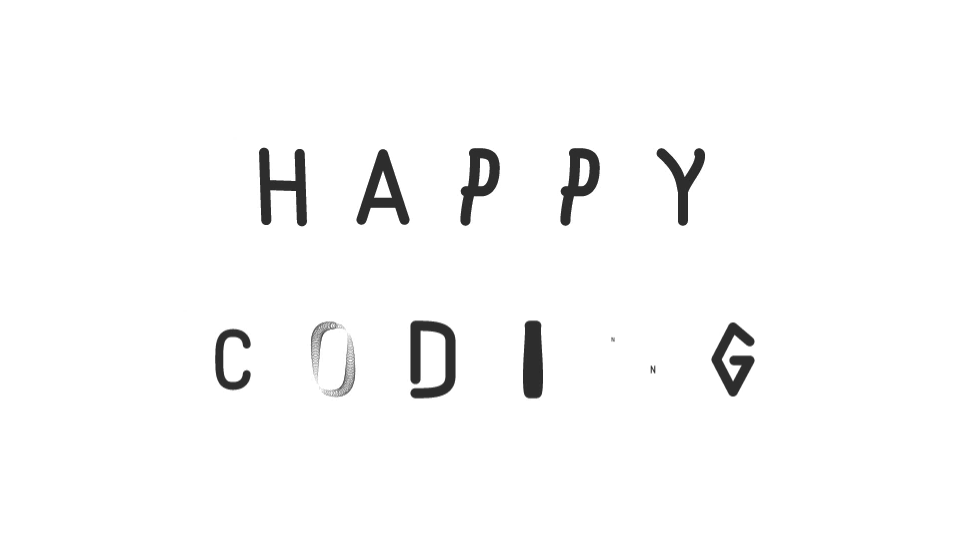

# Sky Banner Skeleton :palm_tree: :monkey: :lollipop: 

This is a skeleton to create an HTML5 banner from scratch. This template is using CreateJS and TweenMax. You can see the versions of the libraries in the file names.   

## Getting Started


#### Set the size of the creative

* Index.html - Set width and height values of the canvas to equal the size of your banner, for example:

    ```html
    <canvas id="stage" class="canvas" width="298" height="248">Your browser does not support the HTML canvas element</canvas>
    ```

* Main.css - Set the values of all width and height properties in the css to equal the size of your banner, for example:

    ```css
    advert {
      width: 300px;
      heigh: 250px;
    }
    ```

* Main.js - Set `var bannerSize` and `Application_NxN` to equal the size of your banner, for example:
   
    ```javascript
    var bannerSize = '300x250';
    devDynamicContent.Application_300x250= [{}];
    ```

#### Set Double Click Profile ID
```javascript     
var numberID = 1234564789;
```    

#### Upload and use assets
1. Update the link to the asset folder:
  ```javascript
  devDynamicContent.Application_NxN[0].Image_assets = 'https://s0.2mdn.net/ads/richmedia/studio/NumberForlder/';
  ```

2. Update the `queue.loadManifest([])` in `loadAssets()` function:
  ```javascript
  queue.loadManifest([
        // {id:'', src:''},
        {id:'logo', src:'logo'}
  ]);
  ```

3. Use the assets:
  ```javascript
  asset = new createjs.Bitmap(queue.getResult('asset'));
  ```

## Setting up the frames

* In `createSkyIcons()` function add Sky Logo, CTA button and any other logos that appear on every frame and are not animated throughout the banner.

* Edit `FrameN_CreateItems()` and `FrameN_Animate()` functions only. Do **NOT edit** `FrameN_Clean()` functions.


## Using build-in functions 
#### setRegPoints() function
* ``setRegPoints()`` function sets registration points of the given image. The parameters could be either numbers or the word 'center' (automatically calculates the center of the image), for example:

    ```javascript
    logo.setRegPoints(26, 38);
    /* OR */
    logo.setRegPoints('center', 'center');
    /* Image size(20x60); Result: logo.regX = 10, logo.regY = 30; */
    ```

####  setPositions() function
* ``setPositions()`` function sets 'x' and 'y' of the given image. The parameters could be either numbers or the word 'center' (automatically sets 'x' to be the center of canvas width and 'y' to be the center of the canvas height), for example:

    ```javascript
    logo.setPositions(20, 76); 
    /* OR */
    logo.setPositions('center', 'center'); 
    /* Banner(120x600); Result: logo.x = 60, logo.y = 300; */
    ```

####  Set Sheen on an image       
1. Set the registration points (regX and regY) of the image to be the center of the given image:

    ```javascript
    image.setRegPoints('center', 'center');
    ```

2. Apply the sheen: `image.sheen(delay, speed)`
  * empty function generates __default__ values - _delay: 500, speed: 2000_
    
    ```javascript
    image.sheen();
    ```

  * to specify delay and speed, for example:
    
    ```javascript
    image.sheen(2000, 3000);
    ```

3. Still under development

<!-- Add extra value for position to the left with arguments -->
#### Small live text with logo in the bottom right corner of an image
##### `createTx(image, logo, text)`
1. Image parameter
  * Bitmap image.
  * The image should __not__ have any empty transparent pixels on its right and bottom side.
2. Logo parameter
  * Bitmap image.
  * The logo should __not__ have any empty transparent pixels on all sides.
3. Text parameter

<!-- DeFault line-height: 13px;
    z-index: 2;
    text-align: right; values -->

  * Update\Add the live text in the Dynamic Profile:

  ```html
  devDynamicContent.Application_NxN[0].example_tx_small = '<span style="line-height: 18px;"></span><br><span>Example Title<br>Example Season<br>Example Availability</span>';
  ```

  * The text should be in `<span>` elements. There are __default__ values - _font-size: 12px and line-height: 13px_.
  * The first span element is an empty one that has line-height which is equal to __logo height__ in pixels
  
  ```html
  <span style="line-height: Npx"></span>
  ```

  * The second span is where the text message is, which can be styled if you are not happy with the default styling, for example:
  
  ```html
  '<span style="line-height: 18px;"></span><br><span style="line-height: 22px; font-size: 20px;">Example Title<br>Example Season<br>Example Availability</span>'
  ```

  * If you need to style one or more lines of the text differently, then simply add another `<span>` element, for example:
  
  ```html
  '<span style="line-height: 18px;"></span><br><span>Example Title<br>Example Season<br></span><span style="line-height: 22px; font-size: 20px;">Example Availability</span>'
  ```

4. Still under development

#### Legals
###### There are _two_ legal close button options - Circle X Button Icon and 'Hide Legals' Text:
* Index.html 
    * Circle X button icon is set by __default__. So, if you want to use this icon either delete the following line or set it to be equal to an empty string:
    ```javascript
    devDynamicContent.Application_NxN[0].Legal_copy_close = '';
    ```

    * To use 'Hide legals' text, add by the following line.
    ```javascript
    devDynamicContent.Application_NxN[0].Legal_copy_close = 'Hide Legals';
    ```

* Legals.js 
    * Should __not__ be changed. The code takes the canvas size and adapts the legals to the canvas.

* Legals.css

    * Edit __only__ the following properties in `.legal-label` class to position and style the legal close button:
    ```css
    .legal-label {
      left: 10px;
      right: 20px;
      width: 65px;
      height: 15px;
      font-size: 10px;
    }
    ```

## 

